# Knowledge Insulating Vision-Language-Action Models

> **논문**: Knowledge Insulating Vision-Language-Action Models: Train Fast, Run Fast, Generalize Better
> **저자**: Danny Driess, Jost Tobias Springenberg, Brian Ichter, Lili Yu, Adrian Li-Bell, Karl Pertsch, Allen Z. Ren, Homer Walke, Quan Vuong, Lucy Xiaoyang Shi, Sergey Levine (Physical Intelligence)
> **발표**: 2025.05.28 | **분량**: 18 pages
> **블로그**: [pi.website/research/knowledge_insulation](https://www.pi.website/research/knowledge_insulation)
> **논문 PDF**: [pi.website/download/pi05_KI.pdf](https://www.pi.website/download/pi05_KI.pdf)

---

## 목차

1. [개요 및 문제 정의](#1-개요-및-문제-정의)
2. [배경: VLA 모델의 발전](#2-배경-vla-모델의-발전)
3. [핵심 문제: VLM 백본의 지식 손상](#3-핵심-문제-vlm-백본의-지식-손상)
4. [제안: Knowledge Insulation](#4-제안-knowledge-insulation)
5. [아키텍처 상세](#5-아키텍처-상세)
6. [실험 결과](#6-실험-결과)
7. [논의 및 한계](#7-논의-및-한계)
8. [참고 자료](#8-참고-자료)

---

## 1. 개요 및 문제 정의

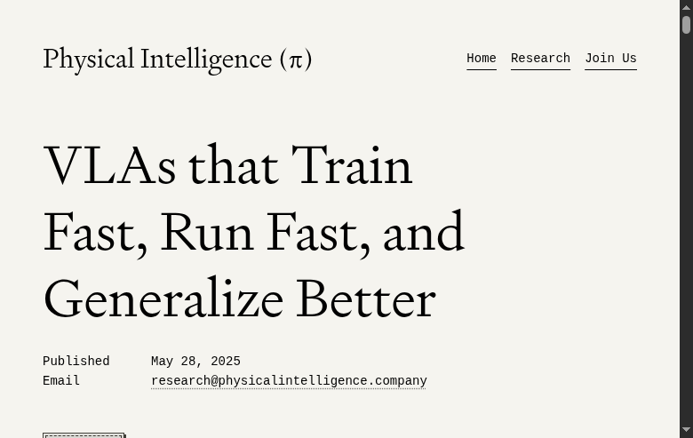

Vision-Language-Action (VLA) 모델은 웹스케일로 사전학습된 Vision-Language Model (VLM)을 로봇 제어에 적용하기 위해 **연속적인 액션 출력**을 추가한 모델이다. 하지만 여기에는 다음과 같은 근본적인 **세 가지 상충 관계(trade-off)**가 존재한다:

| 요구사항 | 설명 |
|---|---|
| **빠른 훈련 (Train Fast)** | VLM 백본이 로봇 제어 표현을 빠르게 학습해야 함 |
| **빠른 추론 (Run Fast)** | 실시간 고주파수 제어를 위해 연속 액션 생성이 빨라야 함 |
| **일반화 (Generalize Better)** | VLM의 웹스케일 사전학습 지식을 보존하여 일반화 성능 유지 |

기존 방법들은 이 세 가지를 **동시에** 만족하지 못했다.

---

## 2. 배경: VLA 모델의 발전

### 1세대 VLA: 이산 토큰화 (RT-2, OpenVLA)

- 관절 각도를 이산 빈(discrete bin)으로 양자화 → 텍스트 토큰처럼 처리
- **장점**: VLM fine-tuning 방식 그대로 적용 가능
- **단점**:
  - 이산화로 인한 **정밀도 손실**
  - 자기회귀(autoregressive) 디코딩으로 **추론이 매우 느림** (~1.3Hz, π0-FAST)
  - 고빈도·정밀 동작에 부적합

### 2세대 VLA: 연속 액션 전문가 (π0, π0.5)

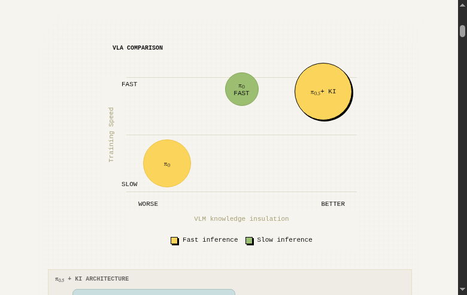

- Action Expert (확산/플로우 매칭) 모듈을 VLM 백본에 추가하여 **연속 액션 직접 생성**
- **장점**: 빠른 추론 (~10Hz), 정밀한 동작 가능
- **단점**:
  - **훈련이 느림** (수렴에 많은 스텝 필요)
  - **VLM 백본의 지식 손상** (언어 이해 능력 저하)

---

## 3. 핵심 문제: VLM 백본의 지식 손상

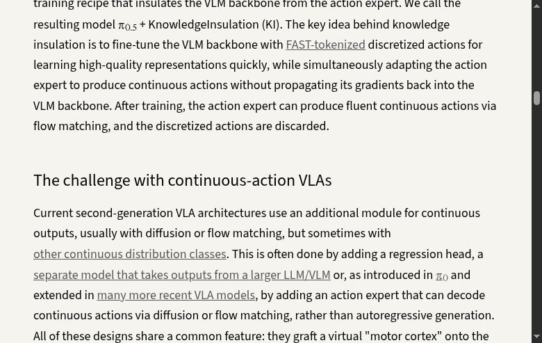

### 3.1 원인: 그래디언트 간섭 (Gradient Interference)

Action Expert의 그래디언트가 VLM 백본으로 역전파되면서 사전학습된 표현을 변질시킨다.

```
VLM Backbone (3B) ← ← ← Gradient Flow (손상!)
       ↓                    ↑
    Prompt ───→ Action Expert (300M)  [Random Init]
```

### 3.2 세부 문제

**① 언어 명령 이해 저하**

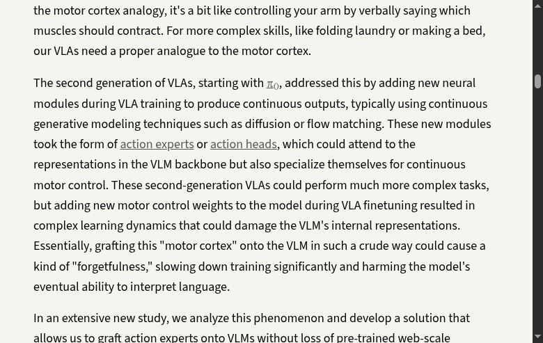

- 예: "숟가락을 통에 넣어라" → 쓰레기를 집는 실패
- VLM의 언어 처리 능력이 액션 전문가의 그래디언트에 의해 간섭받음
- 모델이 이미지 상관관계에 더 의존하게 됨

**② 훈련 속도 저하**

- π0 (naive joint training)는 수렴에 7.5배 더 많은 스텝 필요 (Fig. 6b)
- 무작위 초기화된 Action Expert의 학습이 VLM 백본 전체를 느리게 만듦

**③ Freezing은 해결책이 아님**

- VLM은 로봇 데이터를 본 적이 없어, 백본을 동결하면 **성능이 거의 0%**
- 모터 제어에 필요한 표현이 VLM에 존재하지 않음

---

## 4. 제안: Knowledge Insulation (KI)

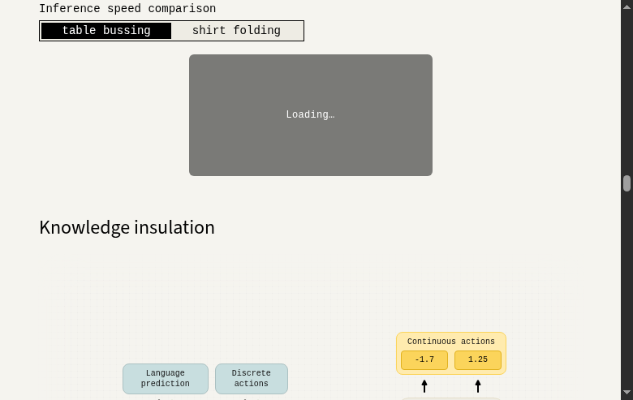

### 4.1 핵심 아이디어

VLM 백본을 Action Expert의 그래디언트로부터 **절연(insulate)**하면서도, 별도의 표현 학습 신호를 통해 로봇 제어에 적응시킨다.

### 4.2 세 가지 핵심 설계 요소

#### ① Stop Gradient (그래디언트 차단)

Action Expert → VLM 백본으로의 그래디언트 흐름을 **주의집중(attention) 연산 내에서 차단**한다.

```
VLM Backbone (3B) ← ✗ Stop Gradient (차단!)
       ↓                    ↑
    Prompt ───→ Action Expert (300M)

  대신, VLM 백본은 FAST 토큰으로 표현 학습
```

수식으로 표현하면:

```python
# Attention score 계산 시 stop-gradient 적용
P_ab = softmax(Q_a(X_a) · sg(K_b(X_b))^T)  # sg = stop gradient
E_a = P_ab · sg(V_b(X_b)) + P_aa · V_a(X_a)  # Value에도 sg 적용
```

- 효과: Action Expert의 그래디언트가 VLM 백본에 도달하지 않음 → **지식 보존**

#### ② FAST 토큰을 통한 표현 학습

- 그래디언트 차단만으로는 VLM이 로봇 제어 표현을 학습할 수 없음
- **FAST** (DCT + 양자화 + BPE) 이산 액션 토큰을 **표현 학습 목적**으로 사용
- 교차 엔트로피(cross-entropy) 손실은 VLM 백본의 지식을 덜 손상시킴
- 훈련 후 FAST 토큰 경로는 **폐기**하고 Action Expert만 사용

#### ③ VLM 데이터 공동 학습 (Co-training)

로봇 액션 데이터 외에도 다양한 데이터 소스로 학습:

| 데이터 유형 | 예시 |
|---|---|
| 로봇 액션 데이터 | 실제 로봇 시연 데이터 |
| 일반 VL 데이터 | 이미지 캡셔닝 (COCO, CapsFusion), VQA (VQAv2, Cambrian-7M) |
| 객체 탐지 데이터 | 실내 장면 바운딩 박스 |
| 로봇 계획 데이터 | 고수준 로봇 명령어-액션 쌍 |

#### 통합 손실 함수

$$L = \mathbb{E}_{D, \tau, \omega} \left[ -\sum_{j=1}^{n-1} M_j^\ell \log p_\theta(\hat{\ell}_{j+1} | x_{1:j}) + \alpha \cdot \mathbb{1}_{\text{act}} \| \omega - a_{1:H} - f_\theta^a(a^{\tau,\omega}_{1:H}) \|^2 \right]$$

- 첫 번째 항: FAST 이산 토큰 + 언어 토큰에 대한 **next-token prediction**
- 두 번째 항: 연속 액션에 대한 **flow matching** 손실
- α=1 (그래디언트가 분리되어 있으므로 균형 조정 불필요)

---

## 5. 아키텍처 상세

### 5.1 전체 구조

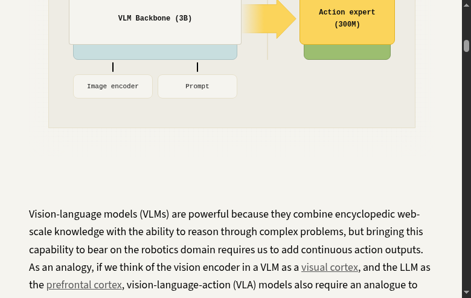

**VLM 백본**: PaliGemma 3B
- 이미지, 텍스트, 상태(proprioception) 처리
- FAST 이산 액션 토큰 예측 (표현 학습)

**Action Expert**: 300M 별도 Transformer
- 연속 액션 생성 (Flow Matching)
- 50-step action chunk 예측
- VLM 백본 주의집중(attention)만 받고 그래디언트 전파 없음

### 5.2 Attention Mask 설계

| 토큰 간 관계 | Attention 허용 | 이유 |
|---|---|---|
| 이미지/언어 → FAST 액션 | O | 자기회귀적 디코딩 |
| VLM 백본 → Action Expert | O | 단방향 정보 흐름 |
| FAST 액션 → Action Expert | **X** | 정보 누출 방지 |
| Action Expert → VLM 백본 | **X** (Stop Gradient) | 지식 절연 |

### 5.3 State 표현 방식

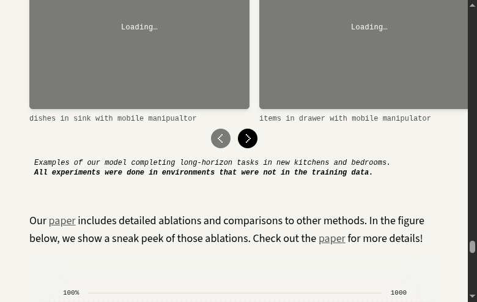

| 방식 | 설명 | 성능 |
|---|---|---|
| **Text State** | 상태를 숫자 텍스트로 이산화 | **우수** (VLM과 일관) |
| **Continuous State** | 실수값을 Projection으로 직접 임베딩 | **우수** |
| **Special Token State** | 각 빈을 특수 토큰에 매핑 | 저조 |

---

## 6. 실험 결과

### 6.1 실제 로봇 태스크

#### Items in Drawer (미지 환경, 단일팔 정적 로봇)

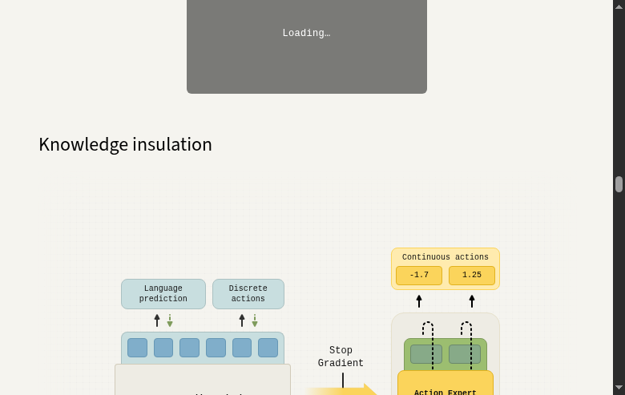

| 방법 | 성능 | 언어 명령 수행 |
|---|---|---|
| **π0.5 + KI** | **최고** | **최고** |
| joint-training (no stop-grad) | 중간 | 저조 |
| π0-FAST | 낮음 (느림) | 양호 |
| π0 (naive) | 낮음 | 저조 |
| Frozen Backbone | 거의 0% | — |

#### Table Bussing

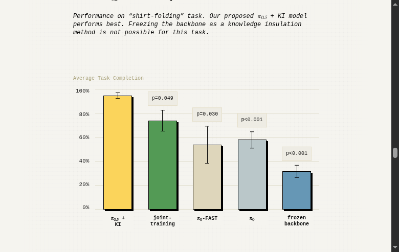

| 방법 | 성능 | 언어 수행 | 실행 시간 |
|---|---|---|---|
| **π0.5 + KI** | **0.95** | **0.90** | **~200초** |
| joint-training | 0.88 | 0.85 | ~250초 |
| π0-FAST | 0.85 | 0.88 | **~400초 (2배)** |
| π0 | 0.70 | 0.50 | ~300초 |

#### Shirt Folding (양팔 로봇)

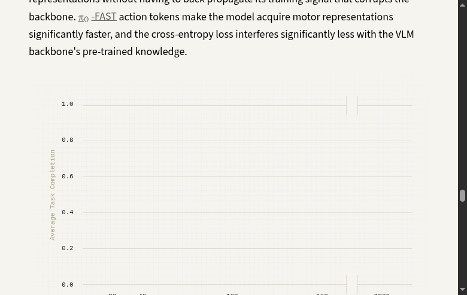

- **π0.5 + KI**: 50% 성공률 (p=0.083)
- π0: 20% (p=0.001)
- π0-FAST: 30% (p=0.002)
- Frozen Backbone: **불가능**

#### Mobile Manipulation 4종 (미지 환경)

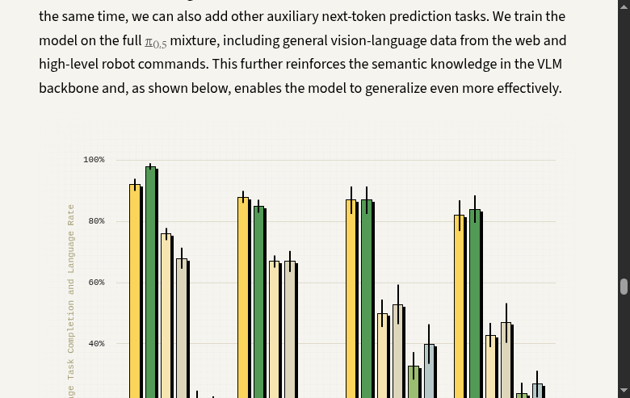

**π0.5 + KI > joint-training > π0-FAST > π0** (모든 태스크에서 일관된 성능 우위)

### 6.2 공개 벤치마크

#### LIBERO

| 태스크 | Ours | OpenVLA-OFT | π0 | π0-FAST | Baku | MoDE |
|---|---|---|---|---|---|---|
| LIBERO-Spatial | **97.8** | 98.4 | 98.8 | 96.8 | — | — |
| LIBERO-Object | 97.8 | **98.4** | 98.8 | 96.8 | — | — |
| LIBERO-Goal | 95.6 | **97.9** | 95.8 | 88.6 | — | — |
| LIBERO-Long (10) | 85.8 | 94.5 | 85.2 | 60.2 | 86.0 | 94.0 |
| **LIBERO-90** | **92.7** | — | — | — | 90.0 | 95.0 |
| **LIBERO-Spatial** (from generalist) | **96.0** | — | — | — | — | — |

→ LIBERO-90과 LIBERO-Spatial에서 **State-of-the-Art**

#### DROID (실세계)

| 방법 | Score |
|---|---|
| **π0.5 + KI** | **0.55 ± 0.09** |
| π0 | 0.49 ± 0.09 |
| π0-FAST | 0.45 ± 0.09 |

### 6.3 OOD 객체 일반화


- **VLM 데이터 공동 학습 시 OOD 일반화율 극대화**
- Stop Gradient만으로도 일부 효과 있음
- **VLM 데이터 + Stop Gradient 조합이 최적**

### 6.4 훈련 속도

**π0.5 + KI = π0-FAST** (가장 빠름) >>> **π0** (7.5배 느림)

- 20K 스텝에서 π0.5 + KI는 80% 성능, π0는 10% 미만
- 160K 스텝에서 π0가 겨우 80% 도달

---

## 7. 논의 및 한계

### 7.1 장점 요약

| 목표 | 달성 여부 | 설명 |
|---|---|---|
| **Train Fast** | ✅ | FAST 토큰 표현 학습으로 빠른 수렴 (π0 대비 7.5배) |
| **Run Fast** | ✅ | Action Expert로 연속 액션 고속 생성 (10Hz) |
| **Generalize Better** | ✅ | VLM 지식 보존 + VLM 데이터 공동 학습으로 일반화 향상 |

### 7.2 한계

| 한계 | 설명 |
|---|---|
| **훈련 비용 20% 증가** | 이산 토큰 + 연속 액션 동시 학습으로 계산량 증가. 단, 수렴 속도 향상으로 상쇄 |
| **언어 명령 완벽하지 않음** | 데이터 상관관계에 의해 언어를 무시하는 경우 여전히 존재 |
| **단일 백본 의존** | PaliGemma 3B 고정, 다른 VLM 백본에서의 검증 필요 |
| **LIBERO-10 성능** | 기존 SOTA 대비 낮음 (긴 horizon 태스크에서 추가 연구 필요) |

### 7.3 향후 방향

- 웹스케일 지식과 로봇 모터 제어의 **더 깊은 통합**
- **순차적 추론·계획** 기능 추가
- 복잡 장기 과제의 **의도적·목표 지향적** 수행
- 더 다양한 로봇 플랫폼 및 실제 응용으로 확장

---

## 8. 참고 자료

### 관련 논문

| 논문 | 설명 |
|---|---|
| [π0](https://www.pi.website/blog/pi0) | VLA with flow matching action expert |
| [π0.5](https://www.pi.website/blog/pi05) | Two-stage training (FAST → continuous) |
| [π0-FAST (FAST)](https://www.pi.website/research/fast) | Efficient action tokenization |
| [RT-2](https://arxiv.org/abs/2307.15818) | First-generation VLA (discrete actions) |
| [OpenVLA](https://arxiv.org/abs/2406.09246) | Open-source VLA |
| [OpenVLA-OFT](https://arxiv.org/abs/2502.19645) | Parallel decoding VLA |
| [HybridVLA](https://arxiv.org/abs/2503.10631) | Hybrid diffusion + autoregressive |
| [GR00T N1](https://arxiv.org/abs/2503.14734) | Humanoid foundation model |

### 비주얼

- **실험 영상**: [pi.website/research/knowledge_insulation](https://www.pi.website/research/knowledge_insulation)
- **논문 PDF**: [pi.website/download/pi05_KI.pdf](https://www.pi.website/download/pi05_KI.pdf)
- **저자**: research@physicalintelligence.company

---

### 부록: 핵심 코드 스니펫 (개념적)

**Stop Gradient Attention** (식 5-6):

```python
# Attention score 계산
P_bb = softmax(Q_b(X_b) @ K_b(X_b).T)                    # backbone → backbone
P_ab = softmax(Q_a(X_a) @ sg(K_b(X_b)).T)                # action → backbone (sg)
P_aa = softmax(Q_a(X_a) @ K_a(X_a).T)                    # action → action

# Attention output
E_b = P_bb @ V_b(X_b)                                    # backbone output
E_a = P_ab @ sg(V_b(X_b)) + P_aa @ V_a(X_a)              # action output (sg on backbone values)
```

**Joint Training Loss** (식 4):

```python
# 이산 액션 + 언어 손실 (next-token prediction)
loss_ar = cross_entropy(predicted_tokens, target_tokens)  # FAST + language

# 연속 액션 손실 (flow matching)
loss_flow = mse(flow_target, flow_predicted)              # continuous actions

# 통합 손실 (α=1)
loss = loss_ar + loss_flow
```